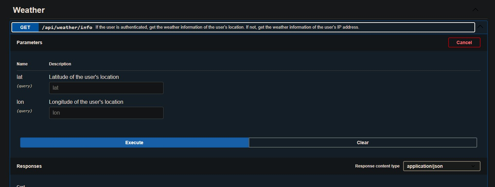

  


# Project Setup Guide

This guide provides instructions for setting up and running our project. Follow these steps to get started:

## 1. Environment Configuration

### `.env` File

- Copy the `.env.example` file to `.env.production`.
- Update the necessary environment variables in the `.env.production` file.
- Make sure to replace the placeholders (e.g., `example_64423923`, `example_r0a96lef85e4qppf.apps.googleusercontent.com`, and `example_be53cc128840e215c`) with your actual API keys.

### API Keys

#### Facebook API Keys

1. Go to the [Facebook for Developers](https://developers.facebook.com/apps) page.
2. Click on "Create App" and choose "For Everything Else."
3. Provide a display name for your app and a valid email address.
4. Once your app is created, you'll find the **App ID** and **App Secret** in the settings.
5. Update the `.env.production` file with your Facebook API keys.

#### Google API Keys

1. Go to the [Google API Console](https://console.developers.google.com/).
2. Create a new project.
3. Configure OAuth consent screen details.
4. Under "Credentials," create an OAuth client ID.
5. Choose "Web application" as the application type.
6. Specify the authorized JavaScript origins (e.g., `http://localhost`).
7. Obtain the **Client ID** and **Client Secret**.
8. Update the `.env.production` file with your Google API keys.

#### OpenWeatherMap API Key

1. Sign up on the [OpenWeatherMap website](https://openweathermap.org/appid).
2. After signing up, you'll receive an API key (APPID) via email.
3. Update the `.env.production` file with your OpenWeatherMap API key.

## 2. Running the Project for `Production`

### Using Docker Compose(Simplest Way)

1. Run the following command to start the project using Docker Compose:
   ```bash
   docker-compose up
   ```
   This will spin up the required services (including the PostgreSQL database).
   Ensure that `docker` and `docker-compose` is installed on your machine before running this command.

### Without Docker Compose

1. Create a PostgreSQL database (if not using Docker Compose).

2. Update the `.env.production` file with your database credentials.

3. Install project dependencies:
   ```bash
   npm install
   ```

4. Build the project:
   ```bash
   npm run build
   ```

5. Start the application(Production Mode):
   ```bash
   npm run up
   ```

6. Stop the application:
   ```bash
   npm run down
   ```    

5. Start the application(Development Mode):

   Ensure that the `nodemon` package is installed globally on your machine.
   Also `.env.development` file should be present in the root directory.

   ```bash
   npm run up
   ```
## 3. Running the Project for `Development`

To run the project in developer mode, follow these steps:

1. **Two Terminals**:
   - Open two separate terminals (command prompts).

2. **Terminal 1 (Watch Mode)**:
   - In the first terminal, run the following command to watch for changes and automatically rebuild the project:
     ```bash
     npm run watch
     ```

3. **Terminal 2 (Development Server)**:
   - In the second terminal, run the following command to start the development server:
     ```bash
     npm run dev
     ```
   - This will start your application in development mode, allowing you to see real-time changes as you edit the code.


# How to Authenticate with Facebook and Google 

1. ### Authenticate with Facebook:
   - Click on the "Facebook Auth" link.
   - You'll be redirected to the Facebook login page.
   - Enter your Facebook credentials and click on "Log In."
   - You'll be redirected back to the application with a success message.
   - Don't click on Try button, its not redirecting to the home page.


2. ### Authenticate with Google:
   - Click on the "Google Auth" link.
   - You'll be redirected to the Google login page.
   - Enter your Google credentials and click on "Next."
   - Click on "Allow" to grant permission to the application.
   - You'll be redirected back to the application with a success message.


3. ### Once authenticated, you can view the user's profile details and weather information.


4. ### Check the weather information for a specific city by entering the city name in the search bar.
   - Once you are logged in, you can get the weather information
   - You can specify the longitude and latitude of the city to get the weather information.
   - If not specified, the weather information will be fetched based on the user's ip address.

